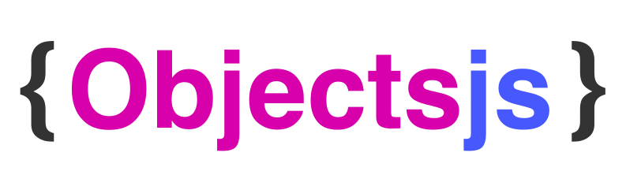

<a href="https://rubygems.org/gems/objectsjs" title="Install gem"></a> <a href="https://github.com/objectsjs/objectsjs" title="GitHub"></a> <a href="https://codeberg.org/objectsjs/objectsjs" title="Codeberg"></a>

<p align="center"></p>

# Objectsjs

<p><big><strong>TLDR:</strong> Instead of binding behaviour to the view and then binding the view to the state, Objectsjs couples state and behaviour together and then binds them to the view.</big></p>

Because of the interactivity of a user interface, coupling the view layer with the behaviour layer is a bad practice. Defining behaviour on on the view leads to bugs and a disconnect between state and behaviour. Instead we should couple behaviour with its closely associated state and let the coupled state and behaviour update the view. This results in a cleaner separation between two very different layers, and a closer association between two very associated layers

<p align="center"><big>We've got a serious problem; the front-end is really confusing.</big></p>

In mainstream frameworks there's a circular dependency workflow:
```
State -> Presentation/Behaviour binds to State -> Presentation/Behaviour -> Presentation/Behaviour changes State
```

It's a circular mess. It leads to "interaction" bugs that are difficult to replicate and predict. When we have both presentation and behaviour binding to state bad things happen. We need to separate behaviour from presentation, and stop behaviour and presentation binding to state. We need to inverse the equation and have state and behaviour binding to presentation:
```
State/Behaviour -> State binds to Presentation -> Presentation
```

When we say "binding" here we're really just making the comparison with the current way of doing things simpler. In practice Objectsjs binds to elements that its configured to target, but then creates/updates/destroys elements to match its internal state. This gives you the best of both worlds; you can integrate Objectsjs with any HTML page at any point in its DOM hierarchy.

While in a practice behaviours are injected to the presentation layer so that the user can affect state, conceptually they are coupled to state/objects and reevaluate from here. So the state/behaviour binds to the presentation, instead of presentation/behaviour binding to state.

To achieve this seperation between state/behaviour and its presentation we focus on the single source of truth; state. State is represented as plain old JavaScript objects... and Objectsjs is just that; objects.

It's just objects nested within objects all the way down. Instead of binding the presentation layer to state, these objects bind state to the presentation layer and transfer and behaviour to it. The presentation layer should never affect state, only behaviour should affect state and it should be decoupled from presentation. State and behaviour are decoupled from presentation but in a way where your data structure matches the presentation.

You manage Objects using native JavaScript functions. Now you get to see the entire state tree of your application natively in the browser... it's all there in `window.objects`. You don't have to use a JS framework browser extension just to see your application's state. Data is locally scoped per object. Dependencies are implicit based on which objects reference which objects.

It's truly simple and actually understandable, while handling the complexity that a modern web application needs.

## Back-end

In a back-end application where the "UI code" runs once, coupling state and "behaviour" is okay. This is because it's not really behaviur in the sense of a user interacting with a UI, but cold hard business logic that runs once and doesn't as easily get out of sync.
